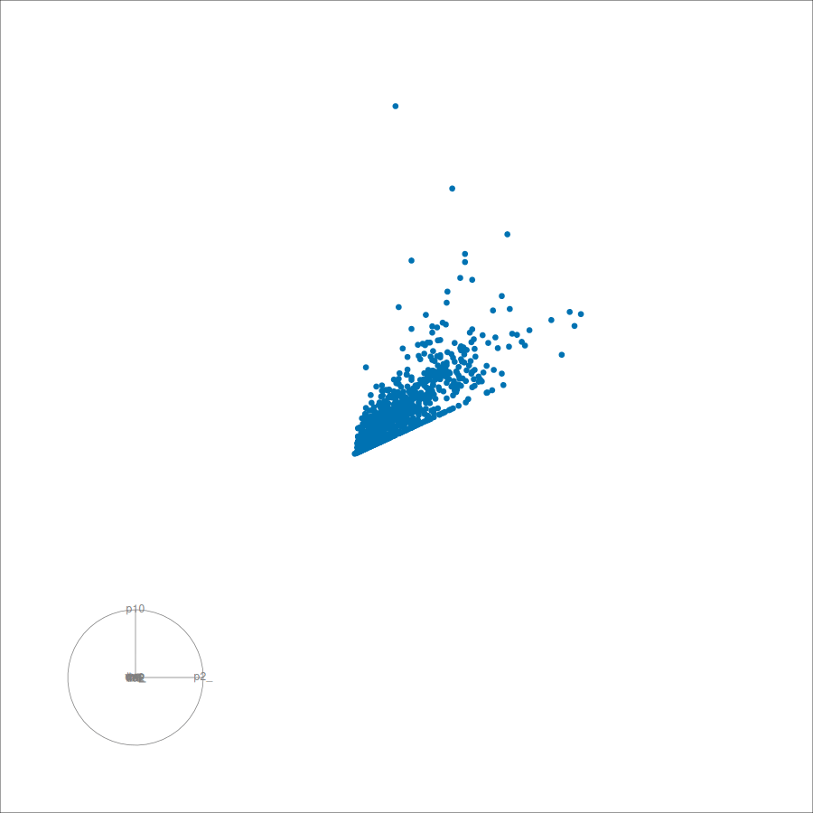

# High-dimensional methods {#sec-highdim}

```{r}
#| label: setup9
#| include: false
#| cache: false

source("before-each-chapter.R")
# Set up for using rgl
options(rgl.useNULL = TRUE)
rgl::setupKnitr()
```

Suppose we have observations $\bm{y}_1, \ldots, \bm{y}_n$, where each observation is of length $m$.
We can think of each observation as a point in $m$-dimensional space.
In this chapter, it will be helpful to switch between this view of the data as a collection of vectors, and the matrix view of the data where each observation is one row of an $n \times m$ data matrix $\bm{Y}$.
That is, the $i$th row of $\bm{Y}$ is $\bm{y}_i^\intercal$.
This is usually how data is stored in practice (think of a tibble or data frame in R), where the columns correspond to the variables and the rows correspond to the observations.

The curse of dimensionality (@sec-curse) makes it difficult to detect anomalies once the number of variables, $m$, grows too large.
In practice, even a moderate number of variables (e.g., $m > 5$) can cause problems for some methods.
The high-dimensional methods described in this chapter are designed to address these challenges, by reducing the dimensionality of the data while preserving the relevant structure for anomaly detection.

## Projections {#sec-projections}

The simplest way to reduce the dimensionality of the data is to use **linear projections**: linear combinations of the original variables that map each $m$-dimensional observation to a lower-dimensional space.
While anomalies may be hard to detect in the full high-dimensional space, they often become visible when viewed from the right projection direction.
Different projection directions preserve different aspects of the joint structure, so the choice of direction matters.
Understanding the geometry of projections sets the foundation for the methods described in the rest of this chapter.

To keep the geometry simple, we will scale all variables to have mean zero and unit variance, although to preserve interpretability, no rotation will be applied in the scaling (@sec-scaling).
The ideas throughout the chapter will be illustrated using air quality and meteorological variables measured hourly at the Aotizhongxin monitoring station (at the Olympic Sports Centre) in Beijing, over May 2014.

```{r}
#| label: aotizhongxin
#| code-fold: false

az_aq <- air_quality |>
  filter(station == "Aotizhongxin", year == 2014, month == 5) |>
  select(-station) |>
  tidyr::drop_na()
Y <- az_aq |>
  select(pm2_5:rainfall, wind_speed) |>
  mvscale(center = mean, scale = sd, cov = NULL)
Y
```

### Projecting from 2 to 1 dimension

The simplest case maps two variables to a single number.
A projection onto a vector $\bm{a} = (a_1, a_2)^\intercal$ gives a score
$$
  w_i = \bm{a}^\intercal \bm{y}_i = a_1 y_{i,1} + a_2 y_{i,2}
$$
for each observation $\bm{y}_i$, where $\bm{a}$ is a unit vector (i.e., $\|\bm{a}\| = \sqrt{a_1^2 + a_2^2} = 1$).
The projection is a linear transformation that maps the 2D data cloud onto the line defined by $\bm{a}$, with $w_i$ giving the position of the projected point along that line.

Switching between the vector and matrix views of the data is the source of a notational subtlety: when we write a projection for a single observation, we use left multiplication $w_i = \bm{a}^\intercal\bm{y}_i$, but when we write it for the whole data matrix, we use right multiplication to get the $n$-vector of scores:
$$
  \bm{w} = \bm{Y}\bm{a}.
$$
These are equivalent, and are linked by a transpose: $\bm{w}^\intercal = \bm{a}^\intercal \bm{Y}^\intercal$.

To illustrate the idea, let's set $\bm{a} = (0.8, 0.6)^\intercal$.
Note that this is a unit vector: $\sqrt{0.8^2 + 0.6^2} = 1$.
The projection direction is a line through the origin with slope $0.6/0.8 = 0.75$.
This means that the projection will capture variation in both variables, but with greater weight on the first variable than the second.

@fig-proj-geometry shows an example using this value of $\bm{a}$ applied to the standardised carbon monoxide (`co`) and nitrogen dioxide (`no2`) measurements at Aotizhongxin.
The blue line is the projection direction.
The five orange points are randomly selected observations, showing how they project onto the line.
The resulting scores are the blue dots on the line.

```{r}
#| label: fig-proj-geometry
#| code-fold: true
#| fig-cap: >-
#|   Projection of standardised carbon monoxide and nitrogen dioxide from Aotizhongxin onto one dimension.
#|   The blue line shows the projection direction $\bm{a}$.
#|   Five randomly selected observations (in orange) are shown projecting onto the line, with the resulting scores shown as blue dots.
#| dependson: aotizhongxin

set.seed(4)
# The projection direction
a <- c(0.8, 0.6)
# Select five random observations to illustrate the projection
show_pts <- Y |>
  slice_sample(n = 5) |>
  mutate(
    w = a[1] * co + a[2] * no2,
    foot_co = w * a[1],
    foot_no2 = w * a[2]
  )
# Construct the plot
ggplot(Y, aes(x = co, y = no2)) +
  geom_point(alpha = 0.25) +
  geom_abline(slope = a[2] / a[1], intercept = 0, colour = "#0072B2") +
  geom_segment(
    data = show_pts,
    aes(x = co, y = no2, xend = foot_co, yend = foot_no2),
    colour = "#D55E00",
  ) +
  geom_point(
    data = show_pts,
    aes(x = foot_co, y = foot_no2),
    colour = "#0072B2",
    size = 3
  ) +
  geom_point(data = show_pts, colour = "#D55E00", size = 2) +
  coord_equal() +
  labs(x = "Standardised carbon monoxide", y = "Standardised nitrogen dioxide")
```

Projections can be thought of like shadows.
Imagine a light source shining on the data cloud from a direction perpendicular to $\bm{a}$; the projection scores are the positions of the shadows cast by the observations onto the line defined by $\bm{a}$.

The projection direction $\bm{a}$ can be any unit vector, so there are infinitely many ways to project the data.
Each choice of $\bm{a}$ captures a different perspective on the joint variation in the data.
Some directions may align with the main axis of variation (like the one shown in @fig-proj-geometry), giving a wide spread of scores; others may be nearly orthogonal to that axis, giving a narrow spread; still others may align with the original coordinate axes.
For example, $\bm{a} = (1, 0)^\intercal$ projects onto the carbon monoxide axis, while $\bm{a} = (0, 1)^\intercal$ projects onto the nitrogen dioxide axis.

The variance of the scores is a measure of how much of the joint variation is captured by that direction, and is given by
$$
  \text{Var}(w) = \bm{a}^\intercal \bm{\Sigma} \bm{a},
$$
where $\bm{\Sigma}$ is the $2 \times 2$ covariance matrix of the data $\bm{Y}$.
The variance is maximised when $\bm{a}$ is the leading eigenvector of $\bm{\Sigma}$; then the leading eigenvalue is the maximum variance.
This is the basis of principal component analysis, which we will discuss in @sec-pca.

The "residual" from the projection is the difference between the original observation and its projection onto the line.
So for an observation $\bm{y}_i$, the residual is $\bm{r}_i = \bm{y}_i - \bm{a} w_i$.
The magnitude of the residual is a measure of how much of the variation in that observation is not captured by the projection, and is known as the "orthogonal distance".
(The length of each orange line in @fig-proj-geometry is the orthogonal distance for the corresponding observation.)
If the residual is large, it means that there are aspects of that observation that are not well represented by the projection direction $\bm{a}$.
This is important for anomaly detection, because an observation that appears normal in one projection may have a large residual, indicating that it is an anomaly in another projection.

### Projecting from 3 to 2 dimensions

Let's add a third variable, `pm2_5`, measuring the particulate matter with diameter less than 2.5 micrometres.
@fig-aq3d shows the standardised `co`, `no2` and `pm2_5` measurements at Aotizhongxin in a 3D scatterplot.
What you see on the screen is a 2D projection of the 3D data.
Think of a light source directly behind the screen, casting shadows of the data points onto the screen.
The projection direction is perpendicular to the screen, so you are seeing the data from that perspective.
As you rotate the plot, you are changing the projection direction, which gives different perspectives on the joint structure.

::: {#fig-aq3d}
::::: {.figure-content}
```{r}
#| label: aq3d-plot
#| webgl: true
#| code-fold: true
#| cache: false
#| dependson: aotizhongxin

rgl::plot3d(
  Y[, c("co", "pm2_5", "no2")],
  size = 1,
  alpha = 0.25,
  type = "s"
)
```
:::::

Interactive 3D scatterplot of the carbon monoxide, nitrogen dioxide and particulate matter (diameter $< 2.5\ \mu\text{m}$) at Aotizhongxin.
:::

A pairwise scatterplot matrix, such as that shown in @fig-proj-pairs3, shows three different 2D projections of the 3D data.
Each panel is the projection you would see if you were facing the above cube perpendicular to the face not shown in the plot.

```{r}
#| label: fig-proj-pairs3
#| code-fold: false
#| fig-cap: >-
#|   Pairwise scatterplots and correlations for standardised carbon monoxide, nitrogen dioxide and particulate matter at Aotizhongxin.
#|   All three pairs are strongly correlated, so the joint variation is nearly confined to a two-dimensional subspace.
#| dependson: aotizhongxin
#| message: false
#| warning: false

Y |>
  select(co, no2, pm2_5) |>
  GGally::ggpairs()
```

### General projections

A projection from $m$ variables onto a $k$-dimensional subspace is defined by an $m \times k$ **mapping matrix** $\bm{A}$ where $\bm{A}^\intercal\bm{A} = \bm{I}_k$.
In other words, the columns of $\bm{A}$ are "orthonormal": each column is a unit vector, and all columns are mutually orthogonal (i.e., $\bm{a}_i^\intercal\bm{a}_j = 0$ for any two distinct columns $i$ and $j$).
The columns of $\bm{A}$ define the projection directions, and they form a **basis** for the $k$-dimensional subspace: i.e., any point in the subspace is a unique linear combination of them.
The projection of $\bm{y}_i$ is the $k$-vector of scores
$$
  \bm{w}_i = \bm{A}^\intercal \bm{y}_i.
$$

Recall that in the 2-dimensional example of @fig-proj-geometry, the score $w_i$ gave the position of a point *along* the projection line, while the projected point itself sat in the plane at $\bm{a}w_i$.
The same two descriptions apply here.
The scores $\bm{w}_i$ are the coordinates of the projection *within* the $k$-dimensional subspace, generalising the position along the line.
To place the projected point back *in the original $m$-dimensional space*, generalising $\bm{a}w_i$, we reconstruct it as $\bm{A}\bm{w}_i$.

Mapping into the subspace and back out again can be combined into a single step.
Substituting $\bm{w}_i = \bm{A}^\intercal\bm{y}_i$ gives $\bm{A}\bm{w}_i = \bm{A}\bm{A}^\intercal\bm{y}_i$, so the projected point is $\bm{P}\bm{y}_i$, where
$$
  \bm{P} = \bm{A}\bm{A}^\intercal
$$
is called the **projection matrix**.
It sends each observation directly to its shadow in the subspace: $\bm{P}\bm{y}_i$ is the point of the subspace closest to $\bm{y}_i$.
Whatever remains,
$$
  \bm{r}_i = \bm{y}_i - \bm{P}\bm{y}_i = (\bm{I}_m - \bm{P})\bm{y}_i,
$$
is the residual --- the part of the observation orthogonal to the subspace, whose length is the orthogonal distance we met in the 2-dimensional case.

As before, the matrix forms follow by transposing these expressions and stacking the rows.
The scores are the rows of the $n \times k$ matrix
$$
  \bm{W} = \bm{Y}\bm{A},
$$
and the residuals are the rows of
$$
  \bm{R} = \bm{Y} - \bm{W}\bm{A}^\intercal = \bm{Y}(\bm{I}_m - \bm{P}).
$$
The covariance matrix of the scores is given by
$$
  \text{Cov}(\bm{W}) = \bm{A}^\intercal \bm{\Sigma} \bm{A}.
$$

The Aotizhongxin station data contains `r english::words(NCOL(Y))` variables.
We can project this `r NCOL(Y)`-dimensional space onto a 2-dimensional subspace defined by an $`r NCOL(Y)` \times 2$ matrix $\bm{A}$ with orthonormal columns.
The resulting 2D projection will capture some aspects of the joint structure, but not all.
For example, suppose we choose the following mapping matrix $\bm{A}$, using a method that we will discuss later in @sec-dobin.

```{r}
#| label: 11dto2d
#| code-fold: false
#| dependson: aotizhongxin

A <- dobin::dobin(Y)$rotation[, 1:2]
colnames(A) <- c("a1", "a2")
rownames(A) <- colnames(Y)
A
```

Then the resulting 2D projection is shown in @fig-proj-11dto2d.

```{r}
#| label: fig-proj-11dto2d
#| code-fold: false
#| fig-cap: >-
#|   Projection of the 11 air quality and meteorological variables at Aotizhongxin onto a 2-dimensional subspace.
#|   Each blue point is the projection of an 11-dimensional observation onto the 2D subspace defined by the columns of $\bm{A}$.
#|   The orange arrows show the axes of the original 11D space, with the length of each arrow indicating how much of the variation in the corresponding variable is captured by the projection.
#|   Only the longest arrows are labelled.
#| dependson: 11dto2d

W <- as.matrix(Y) %*% A
az_aq_proj <- az_aq |>
  bind_cols(W)
biplot_projection(scores = W, loadings = A, label_threshold = 0.1, alpha = 0.2)
```

This is a 2D shadow of the original 11D data cloud.
Each point in the plot corresponds to an 11D observation, and the arrows show the directions of the original variables in the projection.
The length of each arrow indicates how much of the variation in that variable is captured by the projection: the longer the arrow, the more that variable contributes to the projection.
In this example, an increase in any variable will lead to an increase in `a1`, an increase in any variable other than `pm2_5` will lead to an increase in `a2`, and an increase in `pm2_5` will lead to a decrease in `a2`.
The arrows help us to interpret individual points in the projection: the cluster of five points at the bottom of the plot probably corresponds to high `pm2_5` values, while the point on the far right could be high in any of the variables (or high on average across all variables).

A few observations in this projection appear to be anomalies, but we may also have missed some anomalies that are only visible in other projections.
This illustrates the challenge of anomaly detection in high dimensions: we may not know which projection will reveal the anomalies, and there are infinitely many projections to choose from.

### Regression projections

We have, in fact, already met projections in @sec-ols.
Ordinary least squares produces fitted values $\hat{\bm{y}} = \bm{H}\bm{y}$ via the hat matrix $\bm{H} = \bm{X}(\bm{X}^\intercal\bm{X})^{-1}\bm{X}^\intercal$, which is the orthogonal projection of the response vector onto the subspace spanned by the predictor columns.
Like the projection matrix $\bm{P} = \bm{A}\bm{A}^\intercal$, the hat matrix is symmetric and idempotent ($\bm{H} = \bm{H}^\intercal = \bm{H}^2$), so it too is a projection matrix; indeed, if the predictor columns were orthonormal, then $\bm{X}^\intercal\bm{X} = \bm{I}$ and $\bm{H}$ would reduce to $\bm{X}\bm{X}^\intercal$, exactly the form of $\bm{P}$.
The key difference is *what* is being projected: here we project each observation onto a subspace of the **variable** space to reduce dimension, whereas regression projects the **response** vector onto the column space of the **predictors**.
In both cases the residual is the part of the vector orthogonal to the subspace, so the orthogonal distance (the magnitude of the residual $\bm{r}_i$ defined above) plays the same role as the regression residual $\bm{e} = (\bm{I} - \bm{H})\bm{y}$.

### A tour of projections

@fig-proj-11dto2d used one particular mapping matrix $\bm{A}$ to project the 11-dimensional data onto two dimensions.
A different choice of $\bm{A}$ would give a different 2D shadow of the data, potentially hiding some anomalies while revealing others.
Rather than selecting a specific $\bm{A}$, a **tour** [@Asimov1985] moves continuously through many projections, playing them as an animation so that we can watch the data cloud change shape as the projection changes.

A tour follows a sequence of target mapping matrices $\bm{A}_1, \bm{A}_2, \ldots$, smoothly interpolating between them following a *geodesic* path.
That is, the interpolation follows the shortest path between two projections that keeps the columns of $\bm{A}$ orthonormal throughout, so every frame of the animation is itself a valid projection.

How the target matrices are chosen distinguishes different types of tours.

- A **grand tour** chooses the target mapping matrices at random, so that every possible projection is equally likely to be shown.
  This gives a broad view of the data, useful for spotting structure that might not be visible in any single projection chosen in advance.
- A **guided tour** instead finds target matrices that increase some numerical measure of "interestingness", known as a **projection pursuit index** [@FriedmanTukey1974].
  Rather than sweeping through projections at random, the tour moves towards projections that best reveal whatever feature the index is designed to detect.
  In the context of anomaly detection, a guided tour would use an index that measures anomalousness.
  An example is the Stahel--Donoho outlyingness index, which we will discuss in @sec-stahel-donoho.

@fig-grand-tour shows a grand tour of the 11 standardised air quality and meteorological variables from Aotizhongxin, generated using the `tourr` package [@tourr].

```{r}
#| label: grand-tour
#| code-fold: true
#| dependson: aotizhongxin
#| message: false
#| warning: false
#| output: false

set.seed(1)
tourr::render_gif(
  as.matrix(Y),
  tourr::grand_tour(),
  tourr::display_xy(
    axes = "bottomleft",
    col = "#0072B2",
    pch = 19,
    cex = 1.1,
    half_range = 11
  ),
  gif_file = "gifs/highdim-grand-tour.gif",
  frames = 150,
  width = 900,
  height = 900
)
```

```{r}
#| label: fig-grand-tour
#| echo: false
#| dependson: grand-tour
#| message: false
#| warning: false
#| out-width: 70%
#| fig-cap: >-
#|   A grand tour of the 11 standardised air quality and meteorological variables at Aotizhongxin.
#|   Each frame is a different 2-dimensional projection of the data, with axis labels showing the (abbreviated) contribution of each variable to that projection.


```

As the tour rotates through different projections, the bulk of the data remains near the centre, but individual points move in and out of the data cloud.
A point that is hidden inside the cloud in one frame can suddenly appear as a clear anomaly in another, and vice versa.
This is the practical value of a tour for anomaly detection: instead of hoping that a single chosen projection (such as the one in @fig-proj-11dto2d) happens to reveal every anomaly, we can watch many projections in sequence and catch anomalies as they emerge.

For an excellent overview of tours in interactively exploring high-dimensional data through projections, see @mulgar.

## Types of projection anomalies {#sec-projection-anomalies}

There are two types of projection-based anomalies:

1. **Anomalies in the projection space**.
   For example, they may be far from the other observations in the projection, or they may be in a region of the projection space that has low density.
   We can identify them by applying anomaly-detection methods to the projected scores.
2. **Anomalies in the residual space**.
   For example, observations with large residuals, or observations that have otherwise unusual residual magnitudes.
   We can detect them by applying anomaly-detection methods to the residual *magnitudes*.
   It is not usually possible to identify anomalies in the residual space by looking at the residuals themselves, because they are still in a high-dimensional space.

### Anomalies in the projection space

@fig-proj-11dto2d shows some potential anomalies in the projection space.
The general distance-based and density-based anomaly detection methods discussed in @sec-distance-methods and @sec-density-methods can be applied to the projected scores to flag these anomalies.

For example, using KDE surprisals (@sec-kdesurprisals), we can flag the observations with the lowest density in the projection as potential anomalies.
Here the threshold probability of 0.02 has been chosen after some experimentation.

```{r}
#| label: proj-kde
#| code-fold: false
#| dependson: fig-proj-11dto2d

az_aq_proj <- az_aq_proj |>
  mutate(
    prob = surprisals_prob(pick(a1, a2), loo = TRUE, approximation = "gpd"),
    surprisal_anomaly = prob < 0.02
  )
az_aq_proj |>
  filter(surprisal_anomaly)
```

This shows that there was an unusual period between 8am and 12noon on 22 May 2014.
These correspond to the cluster of five observations near the bottom of @fig-proj-kde.

```{r}
#| label: fig-proj-kde
#| code-fold: true
#| dependson: proj-kde
#| fig-cap: "Projection of the 11 air quality and meteorological variables at Aotizhongxin onto a 2-dimensional subspace, with points coloured by whether their KDE surprisal probability is less than 0.02."

az_aq_proj |>
  ggplot(aes(x = a1, y = a2, colour = surprisal_anomaly)) +
  geom_point(alpha = 0.2 + 0.8 * az_aq_proj$surprisal_anomaly) +
  scale_colour_manual(values = c("FALSE" = "#0072B2", "TRUE" = "black"))
```

Further inspection shows that this was a period of high particulate matter (`pm2_5` and `pm10`), `co` and `dew_point`, and moderately high `so2`.
The point on the far right of @fig-proj-kde corresponds to the last line of the table above.
The observations at that time showed high `co` and `dew_point` and very high `rainfall`.

Similar results are obtained with other anomaly detection methods.

### Anomalies in the residual space

To find anomalies in the residual space, we first calculate the **orthogonal distances**, measuring how far an observation lies *from* the projection subspace; i.e., the magnitude of its residual:
$$
  \text{OD}_i = \|\bm{r}_i\| = \|\bm{y}_i - \bm{A}\bm{w}_i\|.
$$
This provides a measure of how much information has *not* been captured by the $k$ components used in the projection.
Observations with the largest orthogonal distances may not be visible as anomalies in the projection space, but they will be visible in the residuals.

```{r}
#| label: fig-proj-residuals1
#| dependson: fig-proj-11dto2d
#| code-fold: false
#| fig-asp: 0.2
#| fig-cap: HDR boxplot of the orthogonal distances of the observations from the projection subspace.
#|   Anomalies are shown in black.

R <- Y - as.matrix(W) %*% t(A)
az_aq_proj <- az_aq_proj |>
  mutate(od = sqrt(rowSums(R^2)))
az_aq_proj |>
  slice_max(order_by = od, n = 10)
az_aq_proj |> gg_hdrboxplot(od)
```

@fig-proj-residuals1 shows an HDR boxplot of the orthogonal distances, with the most extreme observations marked as anomalies.
We can highlight these residual anomalies in the projection space, as shown in @fig-proj-residuals2.
The points with the largest orthogonal distances are highlighted in black.

```{r}
#| label: fig-proj-residuals2
#| dependson: fig-proj-residuals1
#| fig-cap: "Projection of the 11 air quality and meteorological variables at Aotizhongxin onto a 2-dimensional subspace, with points coloured by whether their orthogonal distance from the projection subspace is in the top 1% of all orthogonal distances."

threshold <- quantile(az_aq_proj$od, 0.99, type = 8)
az_aq_proj |>
  ggplot(aes(x = a1, y = a2, colour = od >= threshold)) +
  geom_point(alpha = 0.2 + 0.8 * (az_aq_proj$od >= threshold)) +
  scale_colour_manual(values = c("FALSE" = "#0072B2", "TRUE" = "black")) +
  guides(colour = "none")
```

The observation with the most extreme orthogonal distance is also the most extreme in the projection space, so it is visible as an anomaly in both spaces.
However, the other observations with large orthogonal distances are not visible as anomalies in the projection space, illustrating the importance of considering both spaces when looking for anomalies.

### Outlier map

To explore outlying anomalies, we can look at the relationship between two different distances: the **score distance**, which measures how far an observation lies from the centre *within* the projection space, and the **orthogonal distance** (defined above), which measures how far it lies *from* the projection space.

The **score distance** is the Mahalanobis distance (@sec-distances) of the projected observation from the centre of the projection subspace.
For an observation $\bm{y}_i$ with scores $\bm{w}_i = \bm{A}^\intercal \bm{y}_i$, it is
$$
  \text{SD}_i
  = \sqrt{\bm{w}_i^\intercal (\bm{A}^\intercal \bm{\Sigma} \bm{A})^{-1} \bm{w}_i}.
$$
Observations with the largest score distances will be visible as potential anomalies, because they lie far from the centre of the projection subspace.

```{r}
#| label: score-distances
#| code-fold: false
#| dependson: fig-proj-11dto2d

az_aq_proj <- az_aq_proj |>
  mutate(sd = sqrt(diag(W %*% solve(t(A) %*% cov(Y) %*% A) %*% t(W))))
```

We can plot the orthogonal distance against the score distance to explore the relationship between these two types of anomalies.
This is known as an "outlier map" [@Hubert2005-qa].

```{r}
#| label: fig-odsdplot
#| code-fold: true
#| dependson: score-distances
#| fig-cap: "Orthogonal distance plotted against score distance for the 11 air quality and meteorological variables at Aotizhongxin projected onto a 2-dimensional subspace."

az_aq_proj |>
  ggplot(aes(x = sd, y = od)) +
  geom_point(alpha = 0.4) +
  labs(x = "Score distance", y = "Orthogonal distance")
```

In @fig-odsdplot there is one observation with both large orthogonal and score distances, and two observations with large orthogonal distances but moderate score distances.

Remember that not all anomalies correspond to large distances.
So the outlier map may miss anomalies that lie in a low-density region of either the projection space or the residual space, but which are not far from the centre.
Those in the projection space are better caught using a density-based method applied to the scores, as we illustrated in @fig-proj-kde.
Anomalies that lie in low-density regions of the residual space, but which have small orthogonal distances, are much harder to spot.

## Stahel--Donoho outlyingness {#sec-stahel-donoho}

Stahel--Donoho outlyingness is a robust projection-based measure of how far each observation is from the main body of the data [@Stahel81;@Donoho81] in at least one projection.

For any unit vector $\bm{a}$, project the data to one dimension via $\bm{a}^\intercal\bm{y}_i$, then scale the result using a robust z-score (@sec-scaling), adjusted for skewness [@Brys2005-pc].
The "outlyingness" of $\bm{y}_i$ is the largest absolute z-score over all possible directions $\bm{a}$, so an observation is flagged when it looks extreme in at least one projection.

Stahel--Donoho outlyingness is a guided tour index: it searches over one-dimensional projections: for each candidate direction $\bm{a}$, compute the robust z-scores of the projected data, and keep track of the largest value seen so far.

In practice, the optimisation over all directions is approximated using many candidate projections.
In R, `robustbase::adjOutlyingness()` provides an efficient implementation for computing these scores.

We can apply this to the same standardised air quality and meteorological variables from Aotizhongxin used in @fig-proj-11dto2d.
Because the outlyingness is maximised over all directions, it does not require us to choose a projection in advance: an observation receives a high score if it is extreme in *any* direction.

```{r}
#| label: stahel-donoho
#| code-fold: false
#| dependson: fig-proj-11dto2d

set.seed(1)
ao <- robustbase::adjOutlyingness(Y)
az_aq_proj |>
  mutate(sd_out = ao$adjout) |>
  slice_max(order_by = sd_out, n = 10)
```

The top 10 most anomalous observations by this measure are shown above.
Without our having to choose a projection in advance, it recovers the residual-space anomalies of @fig-proj-residuals2 --- including the run of hours early on 11 May --- because an observation that is extreme in any single direction is found by maximising over all directions.
The price is the opposite blind spot: because the measure relies on one-dimensional projections, it can miss anomalies that only appear unusual when several variables are considered jointly.

## Principal component analysis {#sec-pca}

So far, we haven't said where the mapping matrix $\bm{A}$ comes from.
By far the most common projection method is **principal component analysis (PCA)**, which finds the projection directions that capture the most variance in the data.
The first principal component is the direction of maximum variance, the second is the direction of maximum variance orthogonal to the first, and so on.
Then the lower dimensional projection will contain as much of the variation of the original data as possible, given the number of dimensions in the projection.

### Finding the principal components

For principal component projection, each column of $\bm{A}$ is found sequentially by maximising the variance of the scores it produces, subject to the orthonormality constraints.
If $\bm{\Sigma}$ is the $m \times m$ covariance matrix of the data $\bm{Y}$, then the first direction $\bm{a}_1$ maximises $\text{Var}(\bm{a}_1^\intercal \bm{y}) = \bm{a}_1^\intercal \bm{\Sigma} \bm{a}_1$ subject to $\|\bm{a}_1\| = 1$.
The second direction $\bm{a}_2$ maximises $\text{Var}(\bm{a}_2^\intercal \bm{y}) = \bm{a}_2^\intercal \bm{\Sigma} \bm{a}_2$ subject to $\|\bm{a}_2\| = 1$ and $\bm{a}_2^\intercal \bm{a}_1 = 0$, and so on.

This solution is equivalent to finding the eigenvectors of $\bm{\Sigma}$, and the resulting projection scores are called the principal component scores.
The first $k$ eigenvectors of $\bm{\Sigma}$ form the columns of $\bm{A}$, so PCA simply chooses the orthonormal basis (@sec-projections) that captures the most variance.

The covariance matrix of the scores is given by
$$
  \text{Cov}(\bm{W}) = \bm{A}^\intercal \bm{\Sigma} \bm{A}
                     = \text{diag}(\lambda_1, \ldots, \lambda_k),
$$
where $\lambda_1 \ge \lambda_2 \ge \cdots \ge \lambda_k$ are the first $k$ eigenvalues of $\bm{\Sigma}$.
The covariance matrix of the scores is diagonal, which means that the principal component scores are uncorrelated.
The variance of the $j$th principal component score is $\lambda_j$, so the eigenvalues give the variance captured by each principal component.
The proportion of variance in the original data that has been captured by the first $k$ principal components is given by the sum of the first $k$ eigenvalues divided by the sum of all eigenvalues.

It is possible to calculate up to $k = \min(n - 1, m)$ principal components, but in practice we often only use the first few that capture most of the variance.

### Air quality example

For the 11 air quality and meteorological variables from Aotizhongxin, the 11 principal components can be computed using `prcomp()`, or using `rrcov::PcaClassic()`.
We will use the latter, because it will make it easier to compare with other methods.

```{r}
#| label: pca
#| code-fold: false
#| dependson: aotizhongxin
#| message: false

library(rrcov)
pca <- PcaClassic(Y)
pca$loadings
```

The variance explained by the first $k$ components can also be computed from the output.

```{r}
#| label: pca-var
#| code-fold: false
#| dependson: pca

100 * cumsum(pca$eigenvalues) / sum(pca$eigenvalues)
```

```{r}
#| label: pca-cumvar
#| echo: false
#| dependson: pca

cum_var_explained <- round(100 * cumsum(pca$eigenvalues) / sum(pca$eigenvalues))
```

Using only the first two principal components gives the scores shown in @fig-pca-2d.

::: {#fig-pca-2d}
```{r}
#| label: pca-2d-plot
#| code-fold: false
#| dependson: pca

biplot_projection(pca, alpha = 0.2)
```

Two-dimensional principal component projection of the 11 air quality and meteorological variables from Aotizhongxin.
The first two principal components capture about `r cum_var_explained[2]`% of the variance in the data.
:::

Compare this to the projection shown in @fig-proj-11dto2d.
The variables here are much more evenly weighted, with both positive and negative weights causing the 11D axes (shown in orange) to point in diverse directions.
Also, the anomalies are now much less obvious than in @fig-proj-11dto2d.
This can happen for two reasons:

1. If the anomalies are not aligned with the main axes of variation, they may be hidden in the lower variance components that we have not included in the 2D projection, although they may be visible in the residuals.
2. Because PCA maximises variance, even a small number of extreme observations can dominate the covariance structure.
   Thus, anomalies can cause the principal components to point in a direction that does not capture the main body of the data, making it difficult to detect them in the projection space.
   This is an example of masking (@sec-ols), where the anomalies are hidden due to their influence on the projection directions.

### Diagnostic plot

To distinguish these two situations, @Hubert2005-qa introduced a useful framework for classifying observations in the context of PCA, based on the score distance and orthogonal distance.

::: {.stub-column}
  |                     | Small $\text{SD}_i$ | Large $\text{SD}_i$ |
  | ------------------- | ------------------- | ------------------- |
  | Small $\text{OD}_i$ | Regular observation | Good leverage point |
  | Large $\text{OD}_i$ | Orthogonal outlier  | Bad leverage point  |
:::

- **Regular observations** have small score and small orthogonal distances, so they lie close to the centre of the PCA subspace, and are well represented by the projection.
- **Good leverage points** have large score distances, but small orthogonal distances, so they lie far from the centre of the PCA subspace, but are still well represented by the projection.
  They inflate eigenvalues but do not distort the principal component directions.
  In fact, they can help improve the estimation of the principal component directions, because they provide more information about the structure of the data.
- **Bad leverage points** have large score and large orthogonal distances, so they lie far from both the centre and the PCA subspace.
  They can pull the principal component directions towards themselves---the mechanism behind masking.
- **Orthogonal outliers** have small score distances, but large orthogonal distances, so their projections lie close to the centre of the PCA subspace, but are not well represented by the projection.
  They will not be visible as anomalies in PCA projection, but they will be visible in the residuals.

This "leverage" vocabulary is borrowed directly from regression (@sec-ols).
There, the leverage $h_i = \bm{x}_i^\intercal(\bm{X}^\intercal\bm{X})^{-1}\bm{x}_i$ measures how far an observation lies from the centre of the predictor space, exactly as the score distance does here within the projection subspace; both are Mahalanobis-type distances that flag observations which are extreme *within* the subspace but not necessarily anomalous in their residuals.
The regression residual then plays the role of the orthogonal distance.
The good/bad distinction is identical too: a high-leverage point in regression is *good* if it falls close to the fitted line (small residual) and *bad* if it pulls the line towards itself (large residual), causing the masking described in @sec-ols.
In the same way, a high-score-distance point here is a good leverage point if its orthogonal distance is small, and a bad leverage point if its orthogonal distance is also large, so that it can pull the principal component directions towards itself and mask its own anomaly.

If the data were from a multivariate Normal distribution, then the squared score distances would approximately follow a chi-squared distribution with $k$ degrees of freedom.
While we almost never believe that real data come from a multivariate Normal distribution, this provides a useful reference point for understanding the geometry of the score distances, and for setting a cutoff to classify points.
We flag an observation as a high leverage point if $\text{SD}_i$ is larger than the square root of the 97.5% quantile of the chi-squared distribution with $k$ degrees of freedom.
So under a Normal model, we would expect about 2.5% of the observations to have large score distances and be flagged as leverage points.

The distribution of orthogonal distances is more complicated, but a common approach is to flag an observation as having a large orthogonal distance if $\text{OD}_i$ is greater than the 97.5% quantile of an appropriate Normal distribution.
So again, about 2.5% of the observations would be expected to have large orthogonal distances under a Normal model.

When combined with the outlier map shown above, these cutoffs partition the observations into the four types described in the table.
@fig-pca-outliermap illustrates the idea for the Aotizhongxin data using the two principal components shown in @fig-pca-2d.

```{r}
#| label: fig-pca-outliermap
#| dependson: pca
#| code-fold: false
#| fig-cap: >-
#|   Outlier map for the Aotizhongxin data, using the first two principal components in the projection.
#|   The vertical and horizontal dashed lines show the cutoffs for large orthogonal and score distances, respectively.
#|   The points are coloured according to their classification based on these cutoffs.

outlier_map(PcaClassic(Y, k = 2))
```

Here we can see that there are no points that are particularly bad leverage points (the two black points are very close to the cutoff).
So the most anomalous observations are orthogonal outliers in the residual space, but these are not having a strong effect on the first two principal component directions.

### Varying the number of components

We can repeat this analysis using different values of $k$, the number of principal components used in the projection.
As $k$ increases, more of the variance is captured by the projection, which can cause the orthogonal distances to decrease, and the score distances to increase, because the projection is capturing more of the structure of the data.
Any outlying anomalies that are not well represented by the first few principal components will have large orthogonal distances, but as we include more components, they may become better represented in the projection.
This can lead to some anomalies being classified as good leverage points in higher dimensions, even if they were orthogonal outliers in lower dimensions.

```{r}
#| label: pca-outliermaps-code
#| eval: false
#| echo: true

outlier_map(PcaClassic(Y, k = 1))
outlier_map(PcaClassic(Y, k = 2))
outlier_map(PcaClassic(Y, k = 3))
outlier_map(PcaClassic(Y, k = 4))
```

```{r}
#| label: fig-pca-outliermaps
#| echo: false
#| dependson: aotizhongxin
#| fig-cap: "Outlier maps for the Aotizhongxin data, using different numbers of principal components in the projection."

maps <- lapply(1:4, function(k) outlier_map(PcaClassic(Y, k)))
# Extract one shared legend from a panel containing all four categories
g <- ggplotGrob(maps[[2]] + theme(legend.title = element_blank()))
legend <- g$grobs[[which(g$layout$name == "guide-box-bottom")]]
# Drop the per-panel legends and place the shared one across the bottom
patchwork::wrap_plots(
  maps[[1]],
  maps[[2]],
  maps[[3]],
  maps[[4]],
  patchwork::wrap_elements(legend),
  design = "AB\nCD\nEE",
  heights = c(1, 1, 0.18)
) &
  theme(legend.position = "none")
```

This can be seen in the second-largest score distance in the $k = 4$ plot.
The corresponding observation was an orthogonal outlier in the other plots, but is now a good leverage point, because it is now well represented in the projection.

Notice that we now also have some bad leverage values in $k = 3$ and $k = 4$.
So the third and subsequent principal components are being pulled towards some anomalies, making them harder to identify in the lower dimensional space.
This could be masking some of the anomalies.

## Robust principal components {#sec-robpca}

There are several approaches to "robustifying" PCA, such as computing the eigenvectors of a robust covariance matrix, or using a different objective function that is less sensitive to outliers.
One approach is the ROBPCA algorithm of @Hubert2005-qa, which proceeds in three stages, using robust outlier scores to find a clean starting point and then refining it with robust covariance estimation.

### The ROBPCA algorithm

**Stage 1: Reduce the working dimension.** When the number of variables $m$ is large, the data may not actually fill all $m$ dimensions.
So this first stage identifies the subspace that the data genuinely occupies --- at most $\min(n - 1, m)$ dimensions --- without discarding any information.
This makes the subsequent steps faster and numerically better behaved.

**Stage 2: Find a robust subspace.** For each observation, the Stahel--Donoho outlyingness (@sec-stahel-donoho) is computed to measure how far it lies from the bulk of the data.
A clean subset of the $h$ least-outlying observations is retained (by default $h = 0.75n$; reducing this gives greater robustness at the cost of some efficiency).
Standard PCA is applied to this clean subset of data, so the resulting components are not pulled towards the anomalies.
The number of components $k$ is chosen automatically from the eigenvalues of the clean-subset covariance matrix.

**Stage 3: Robustly estimate the centre and spread.** Within the $k$-dimensional subspace found in Stage 2, the MCD estimator (@sec-robust-cov) is applied to obtain a robust centre $\hat{\bm{\mu}}$ and covariance matrix $\bm{S}$.
The eigenvectors of $\bm{S}$ give the final robust principal component directions.
Because the projection directions are estimated from the bulk of the data rather than from all observations, anomalies cannot pull the components towards themselves.

### Air quality example

This is implemented in the `rrcov::PcaHubert()` function, which chooses four dimensions for the Aotizhongxin data, and gives the loadings shown below.

```{r}
#| label: robpca
#| dependson: aotizhongxin

pca_robpca <- PcaHubert(Y)
pca_robpca$loadings
```

The first two robust principal components are shown in @fig-pca-robpca.
Compared to @fig-pca-2d, these two plots are quite similar, although PC2 has been flipped to point in the opposite direction.
The main differences are in the higher principal components, which are not shown here, but which are more influenced by the anomalies in the standard PCA than in the ROBPCA.

```{r}
#| label: fig-pca-robpca
#| code-fold: false
#| dependson: robpca
#| fig-cap: Two-dimensional robust principal component projection of the 11 air quality and meteorological variables from Aotizhongxin.

biplot_projection(pca_robpca, alpha = 0.2)
```

@fig-pca-outliermap2 shows the outlier maps for the Aotizhongxin data using the ROBPCA algorithm.

```{r}
#| label: pca-outliermap2-code
#| eval: false
#| echo: true

outlier_map(PcaHubert(Y, k = 1, skew = TRUE, mcd = FALSE), alpha = 0.9)
outlier_map(PcaHubert(Y, k = 2, skew = TRUE, mcd = FALSE), alpha = 0.9)
outlier_map(PcaHubert(Y, k = 3, skew = TRUE, mcd = FALSE), alpha = 0.9)
outlier_map(PcaHubert(Y, k = 4, skew = TRUE, mcd = FALSE), alpha = 0.9)
```

```{r}
#| label: fig-pca-outliermap2
#| echo: false
#| dependson: aotizhongxin
#| fig-cap: "Outlier maps for the Aotizhongxin data computed with the ROBPCA algorithm, using different numbers of principal components in the projection."
#| message: false

maps <- lapply(1:4, function(k) {
  outlier_map(PcaHubert(Y, k, skew = TRUE, mcd = FALSE), alpha = 0.9)
})
# Extract one shared legend from a panel containing all four categories
g <- ggplotGrob(maps[[2]] + theme(legend.title = element_blank()))
legend <- g$grobs[[which(g$layout$name == "guide-box-bottom")]]
# Drop the per-panel legends and place the shared one across the bottom
patchwork::wrap_plots(
  maps[[1]],
  maps[[2]],
  maps[[3]],
  maps[[4]],
  patchwork::wrap_elements(legend),
  design = "AB\nCD\nEE",
  heights = c(1, 1, 0.18)
) &
  theme(legend.position = "none")
```

Now there are far fewer bad leverage points than in @fig-pca-outliermaps, and the map changes much less as we increase $k$.
This suggests that the ROBPCA algorithm has found projection directions that are less influenced by the anomalies, so they are easier to identify in the projection space.

### Combining components with orthogonal distances

If we take the four components found by ROBPCA, and add in the orthogonal distances as a fifth dimension, then we can apply a distance-based anomaly detection method to find the most anomalous observations in this 5D space.
For example, we can use an Isolation Forest to find the top 10 most anomalous observations.

```{r}
#| label: robpca-iso
#| code-fold: false
#| dependson: robpca

W_od <- pca_robpca$scores |>
  as_tibble() |>
  mutate(OD = pca_robpca$od)
iso_model <- isotree::isolation.forest(W_od)
az_aq_proj |>
  mutate(iso_score = predict(iso_model, W_od)) |>
  slice_max(order_by = iso_score, n = 10)
```

These are the most extreme hours by this combined measure: the isolated points and the extreme hours late on 31 May that the other methods also single out.

## DOBIN {#sec-dobin}

The mapping matrix $\bm{A}$ can be found in many ways, and the choice of method can have a big impact on the anomalies that are visible in the projection space.
We have already seen how PCA can be distorted by anomalies, and how ROBPCA can mitigate this by finding more robust projection directions.
Another approach is to find projections that are explicitly designed to make anomalies more visible.

**DOBIN** (Distance based Outlier BasIs using Neighbours) is one such method [@Kandanaarachchi2020-lo].
Where PCA looks for the directions of maximum variance (@sec-pca), DOBIN looks for directions in which near neighbours are pushed far apart, on the grounds that an anomaly is an observation lying much further from its neighbours than is typical.
Like PCA, it produces an orthonormal basis and is only a dimension-reduction step rather than an anomaly detector in itself; the resulting coordinates are then handed to one of the distance- or density-based methods of the earlier chapters.
The aim is that, because the basis is built to expose anomalies, fewer components are needed to reveal them than with PCA.

### How DOBIN works

DOBIN is built on a simple way of rewriting squared distances.
Recall from @sec-distances that the squared Euclidean distance between two observations $\bm{y}_i$ and $\bm{y}_j$ is the sum of the squared differences in each variable, $\|\bm{y}_i - \bm{y}_j\|^2 = \sum_\ell (y_{i,\ell} - y_{j,\ell})^2$.
Collecting these per-variable terms into a vector $\bm{z}_{ij}$, whose $\ell$th entry is $(y_{i,\ell} - y_{j,\ell})^2$, the distance becomes the sum of the entries of $\bm{z}_{ij}$, that is $\|\bm{y}_i - \bm{y}_j\|^2 = \bm{1}^\intercal\bm{z}_{ij}$.
Replacing the equal weights $\bm{1}$ by non-negative weights $\bm{a}$ gives a weighted squared distance $\bm{a}^\intercal\bm{z}_{ij}$.
Distance has become a *linear* function of the weights, which turns the search for a direction that stretches distances into an easy problem.

We do not want to stretch all pairwise distances, only those relevant to anomaly detection.
Two observations on opposite edges of the data cloud are far apart, but pulling them further apart reveals nothing about anomalies.
DOBIN therefore restricts attention to pairs of near neighbours (@sec-nn): for each observation it forms the vectors $\bm{z}_{ij}$ to its nearest neighbours, and keeps only those pairs whose distance falls in the upper tail (by default, above the 95th percentile).
The retained vectors $\{\bm{z}_\ell\}$ make up the *Y space*.
Because an anomaly sits far from its neighbours, it contributes several of the largest vectors to this set, so the Y space magnifies the very observations we are trying to find.

The first DOBIN direction is the unit vector $\bm{a}_1$ that makes these retained neighbour distances as large as possible on average; that is, it maximises $\sum_\ell \bm{a}^\intercal\bm{z}_\ell$ subject to $\|\bm{a}\| = 1$.
Because the objective is linear in $\bm{a}$, the solution is immediate --- the best direction is simply the normalised sum of the Y-space vectors,
$$
  \bm{a}_1 = \frac{\sum_\ell \bm{z}_\ell}{\big\|\sum_\ell \bm{z}_\ell\big\|}.
$$
Subsequent directions follow the same recipe applied to what is left over: after removing the part of each $\bm{z}_\ell$ lying along $\bm{a}_1$, the second direction $\bm{a}_2$ is the normalised sum of the residual vectors, and so on.
This is much like the orthogonalisation behind PCA (@sec-pca), except that at each step DOBIN maximises a sum of neighbour distances rather than a variance.
The result is an orthonormal basis $\bm{A} = [\bm{a}_1\ \bm{a}_2\ \cdots]$ whose leading columns point in the directions where neighbours are most stretched apart.
Projecting the data onto these columns, $\bm{W} = \bm{Y}\bm{A}$, gives the DOBIN coordinates, exactly as for any other projection in @sec-projections.

### Air quality example

In fact we have already seen the result.
The two-dimensional projection in @fig-proj-11dto2d was the DOBIN projection of the Aotizhongxin data, and the anomalies it revealed --- in both the projection space (@fig-proj-kde) and the residual space (@fig-proj-residuals2) --- were found in this basis.
The columns of the mapping matrix used there are the first two DOBIN vectors.

```{r}
#| label: dobin
#| code-fold: false
#| dependson: 11dto2d

round(A, 2)
```

The first DOBIN vector $\bm{a}_1$ gives positive weights to all variables, so an observation moves out along the first DOBIN coordinate when *all* of the air-quality and meteorological variables are jointly elevated.
This is why the hours flagged in @fig-proj-kde corresponded to a period of simultaneously high particulates, carbon monoxide and dew point: such hours sit furthest from their neighbours along $\bm{a}_1$.
The second DOBIN vector $\bm{a}_2$ is dominated by `pm2_5`, with the opposite sign to the other variables, and so separates hours whose fine-particulate level is unusual relative to everything else.
Unlike the principal component loadings in @fig-pca-2d, the DOBIN loadings remain easy to read in terms of the original variables, which is a deliberate feature of the method.

Two cautions are worth noting.
First, because the Y space is built from element-wise squared differences, DOBIN is not invariant to rotations of the input space: starting from a rotated set of variables would give a different basis.
This is the price of working one variable at a time, and it is also what keeps the loadings interpretable.
(If rotation invariance matters more than interpretability, one can run PCA first and apply DOBIN to the principal component scores.)
Second, like every projection method in this chapter, DOBIN only reduces the dimension; the anomalies must still be found by applying a distance- or density-based method to the resulting coordinates, as we did in @sec-projections.

So far we have used only the two leading DOBIN directions, because @sec-projections needed a basis we could plot.
DOBIN is not limited to two dimensions, though, and giving it more components lets it expose anomalies that a 2D view cannot.
Following the recipe we used for ROBPCA (@sec-robpca), we take the first four DOBIN components --- the same number ROBPCA chose --- add the orthogonal distance as a fifth coordinate, and pass the result to an isolation forest.

```{r}
#| label: dobin-detect
#| code-fold: false
#| dependson: aotizhongxin

A4 <- dobin::dobin(Y)$rotation[, 1:4]
colnames(A4) <- paste0("a", 1:4)
W4 <- as.matrix(Y) %*% A4
W4_od <- as_tibble(W4) |>
  mutate(OD = sqrt(rowSums((as.matrix(Y) - W4 %*% t(A4))^2)))
iso_model <- isotree::isolation.forest(W4_od)
az_aq_proj |>
  mutate(iso_score = predict(iso_model, W4_od)) |>
  slice_max(order_by = iso_score, n = 10)
```

With only four components, the isolation forest flags both the morning cluster of 22 May seen in @fig-proj-kde and the extreme hours late on 31 May, together with the isolated points the other methods also identify.
A handful of components from a basis built to expose anomalies is enough to surface these episodes.

## Multidimensional scaling {#sec-mds}

All the projection methods so far have started from the data matrix $\bm{Y}$ and produced a low-dimensional set of coordinates.
**Multidimensional scaling (MDS)** instead starts from the $n \times n$ matrix $\bm{D}$ of pairwise distances $d_{ij} = \|\bm{y}_i - \bm{y}_j\|$ between observations (@sec-distances), and looks for a configuration of points $\bm{w}_1, \dots, \bm{w}_n$ in a low-dimensional space, usually $k = 2$ or $3$ dimensions, whose distances $\|\bm{w}_i - \bm{w}_j\|$ reproduce the given $d_{ij}$ as closely as possible [@Borg2005; @Cox2001].
The result is a "map" in which similar observations are placed close together and dissimilar observations far apart, much like reconstructing a map of cities from a table of the distances between them.
More generally, the entries $d_{ij}$ need only be *dissimilarities*: measures of how different two observations are.
Every distance is a dissimilarity, but a dissimilarity need not satisfy the triangle inequality, and we return to this extra generality when we discuss non-metric scaling below.

Working from a matrix of distances, rather than directly from the data, is what distinguishes MDS from PCA.
Any of the distance measures of @sec-distances can be used, including non-Euclidean ones, so MDS applies whenever we can measure how far apart two observations are but cannot form a numerical data matrix --- for example, with mixed categorical and numerical variables, distances between nodes in a network, or edit distances between genomic sequences.
For anomaly detection, the embedding plays the same role as a projection: an observation that is far from all the others in the original distances is placed far from the bulk of the points in the low-dimensional map, where it can be passed to one of the distance- or density-based detectors of @sec-distance-methods or @sec-density-methods.

### Classical scaling

The oldest form of MDS is **classical scaling** [@Torgerson1952], which solves the problem by an eigendecomposition and so is closely related to PCA.
From the matrix of squared distances $\bm{D}^{(2)} = (d_{ij}^2)$, we form the doubly centred matrix
$$
  \bm{B} = -\tfrac12 \bm{J} \bm{D}^{(2)} \bm{J},
$$
where $\bm{J} = \bm{I}_n - \tfrac1n \bm{1}\bm{1}^\intercal$ is the centring matrix that subtracts the row and column means.
If the $d_{ij}$ are the Euclidean distances between the rows of a centred coordinate matrix $\bm{W}$, then $\bm{B} = \bm{W}\bm{W}^\intercal$ is exactly the matrix whose $(i,j)$th entry is the product $\bm{w}_i^\intercal\bm{w}_j$ of the coordinates of observations $i$ and $j$.
We then take the eigendecomposition (@sec-eigen) $\bm{B} = \bm{V}\bm{\Lambda}\bm{V}^\intercal$, with eigenvalues $\lambda_1 \ge \lambda_2 \ge \cdots \ge 0$, and read off the $k$-dimensional configuration as
$$
  \bm{W}_k = \bm{V}_k \bm{\Lambda}_k^{1/2},
$$
the first $k$ eigenvectors scaled by the square roots of their eigenvalues.
As with PCA, the eigenvalues say how much structure each dimension captures, so a few large eigenvalues followed by a sharp drop indicates that a low-dimensional map will represent the distances well.

This is exactly the same as PCA when $\bm{D}$ contains the Euclidean distances between the observations.
Then $\bm{B}$ and the covariance matrix $\bm{\Sigma}$ share the same nonzero eigenvalues (up to the factor $n - 1$), and the classical scaling coordinates $\bm{W}_k$ coincide with the principal component scores of @sec-pca, up to a reflection of the axes.
Classical scaling is therefore PCA computed from the distance matrix instead of from the data, and it is useful precisely when the distances are *not* Euclidean, or when only a matrix of distances is available.
(However, note that the eigenvalues of $\bm{B}$ can be negative when the distances are not Euclidean, and these are discarded.)

### Metric and non-metric scaling

Classical scaling reproduces the distances through an eigendecomposition, but we can instead choose the configuration directly to minimise a measure of misfit.
**Metric MDS** places the points so that the fitted distances $\|\bm{w}_i - \bm{w}_j\|$ match the input distances $d_{ij}$, minimising a loss function known as the *stress*,
$$
  \text{Stress}
  = \sqrt{\frac{\sum_{i<j}\left( \|\bm{w}_i - \bm{w}_j\| - \hat{d}_{ij} \right)^2}{\sum_{i<j} \|\bm{w}_i - \bm{w}_j\|^2}},
$$
where the *disparities* $\hat{d}_{ij}$ are a fixed transformation of the input distances --- the identity, $\hat{d}_{ij} = d_{ij}$, in the simplest case.
There is no closed-form solution, so the configuration is found by iterative optimisation, starting from the classical scaling solution.
A common variant is the @Sammon1969 mapping, which weights each term by $1/d_{ij}$ so that small distances, describing the local structure, are reproduced more faithfully than large ones.

**Non-metric MDS** [@Kruskal1964] relaxes the requirement that the actual values of the $d_{ij}$ be reproduced, asking only that their *rank order* be preserved.
This is where the more general notion of dissimilarity matters: the disparities $\hat{d}_{ij}$ are now allowed to be any monotonically increasing transformation of the $d_{ij}$, obtained by isotonic regression (a monotone least squares fit) of the fitted distances on the ranked dissimilarities.
The configuration and the transformation are updated alternately until the stress converges.
This is the appropriate method when the dissimilarities are ordinal or only loosely calibrated --- for example, subjective similarity ratings, which may not even satisfy the triangle inequality --- because only their ordering is assumed to carry meaning.
It is also more robust to a few large dissimilarities, since these need only be reproduced in rank, not in size.

### Air quality example

We illustrate using the same standardised air quality and meteorological variables from Aotizhongxin.
We first compute the Euclidean distance matrix, and then apply classical scaling using `cmdscale()`.

```{r}
#| label: mds-classical
#| code-fold: false
#| dependson: aotizhongxin

D <- dist(Y)
cs <- cmdscale(D, k = 2, eig = TRUE)
```

For a non-Euclidean view, we apply non-metric MDS to the same distance matrix using `MASS::isoMDS()`, which reports the final stress as a percentage.

```{r}
#| label: mds-nonmetric
#| code-fold: false
#| dependson: mds-classical

nm <- MASS::isoMDS(D, k = 2, trace = FALSE)
```

@fig-mds shows the two configurations side by side.
The classical scaling map reproduces the PCA projection, while the non-metric map preserves only the ordering of the distances, which pulls the bulk of the observations together and pushes the most isolated hours further out.

```{r}
#| label: fig-mds
#| code-fold: true
#| dependson: mds-nonmetric
#| fig-cap: >-
#|   Two-dimensional multidimensional scaling maps of the 11 air quality and meteorological variables from Aotizhongxin, computed from the Euclidean distance matrix.
#|   Left: classical scaling, which reproduces the principal component projection of @fig-pca-2d up to a reflection.
#|   Right: non-metric scaling, which preserves only the rank order of the distances.

bind_rows(
  tibble(x = cs$points[, 1], y = cs$points[, 2], method = "Classical scaling"),
  tibble(x = nm$points[, 1], y = nm$points[, 2], method = "Non-metric scaling")
) |>
  ggplot(aes(x = x, y = y)) +
  geom_point(alpha = 0.2) +
  facet_wrap(~method, scales = "free") +
  labs(x = "First coordinate", y = "Second coordinate")
```

The two extreme anomalies in the non-metric scaling map are from 19 May and 31 May:

```{r}
#| label: mds-nonmetric-cases
#| code-fold: false
#| dependson: mds-nonmetric

az_aq[nm$points[, 2] < -50, ]
```

Because non-metric scaling preserves only the rank order of the distances, it can push anomalies to be even more extreme.

Like PCA and DOBIN, MDS is a dimension-reduction step rather than an anomaly detector in itself: the resulting coordinates are handed to one of the distance- or density-based methods of the earlier chapters.
Its distinctive feature is that it begins from a matrix of pairwise distances --- or, more generally, dissimilarities --- so it can be applied to data for which no natural coordinates exist.

## FastPCS {#sec-fastpcs}

The remaining methods in this chapter detect anomalies directly, rather than producing a projection that is handed to a separate detector.
The first of them is the Fast Projection Congruent Subset (FastPCS) method of @Vakili2014-yc.
Like ROBPCA (@sec-robpca), FastPCS builds a clean subset of data intended to be free of anomalies, but it uses this subset to build a standalone detector rather than a projection.
Also, rather than identify the clean subset using the Stahel--Donoho outlyingness, it uses a different criterion based on the internal cohesion of the subset.

The idea is that a clean group of observations should stay packed together no matter which direction we view it from, whereas a subset that mixes in outlying anomalies will look stretched out from at least some viewpoints.
FastPCS turns this into a score.
It examines many one-dimensional projections of the data, and along each one it identifies the $h$ observations that fall closest together.
A candidate subset earns a good score on that projection when its own members largely coincide with this tightest group, and a poor score when many of its members instead lie spread out along the fringes.
Averaging over many directions measures how consistently cohesive the candidate subset is: the score is small only when the subset stays compact across the widest range of viewpoints.
The subset that minimises this is the "projection congruent subset", and it is taken to be the clean data.

FastPCS estimates a centre and covariance matrix from this clean subset of the data.
Because the anomalies are excluded before the covariance is estimated, they cannot distort it.
The method does require every variable to vary across the observations.
If more than half of all observations share an identical value on some variable, FastPCS then treats those tied observations as the clean subset, the covariance estimated from them collapses, and the algorithm stops with an error.

For the Aotizhongxin data this rules out `rainfall`, which is zero for `r round(100 * mean(az_aq$rainfall == 0))`% of the hours, so we drop it before fitting.
The PCA-based methods avoid this problem because their first stage collapses the data onto the subspace with highest variation.

```{r}
#| label: fastpcs
#| code-fold: false
#| dependson: aotizhongxin
#| message: false

fpcs_fit <- Y |>
  select(-rainfall) |>
  FastPCS::FastPCS()
```

The algorithm returns a robust centre and covariance matrix, estimated from the projection congruent subset, together with the robust Mahalanobis distance (@sec-distances) of every observation from that centre.
This distance is the FastPCS outlyingness index, and corresponds to the PCA score distances: observations far from the clean subset receive large values, while the bulk of the data sits close to the centre.

```{r}
#| label: fastpcs-scores
#| code-fold: false
#| dependson: fastpcs

az_aq_proj <- az_aq_proj |>
  mutate(fpcs = fpcs_fit$distance)
az_aq_proj |>
  slice_max(order_by = fpcs, n = 10)
```

Where the earlier methods flagged only the most extreme hours of 31 May 2014, FastPCS resolves the whole daytime build-up of that day --- a run of hours dominated by extreme carbon monoxide and sulphur dioxide (both around four standard deviations above their means), together with warm temperatures, a high dew point and low wind speeds that would have inhibited dispersion.
This sustained episode is the distinctive contribution of FastPCS.

## HDoutliers algorithm {#sec-hdoutliers}

The methods considered so far all work by estimating a centre and a covariance, and then measuring how far each observation lies from that centre.
The HDoutliers algorithm of @Wilkinson2017-rb takes a different approach, based on the distances between observations rather than their distance from a centre.
It was designed to address several problems at once:

1. Data containing a mixture of categorical and continuous variables.
2. Data with high dimensionality (a large number of variables).
3. Data with a large number of observations.
4. Data where anomalies occur in small clusters, rather than as isolated points.

The central idea is to reduce any high-dimensional problem to one dimension using nearest-neighbour distances (@sec-nn).
Each observation is scored by the distance $d_{i,1}$ to its nearest neighbour, which is equivalent to the kNN anomaly score of @sec-knn-scores with $k = 1$; an anomaly is an observation whose nearest-neighbour distance is unusually large because it sits far from the rest of the data.
The remaining machinery exists to make this single idea work across the four situations above.
Categorical variables are first converted to continuous scores using correspondence analysis.
When there are very many variables, the data are replaced by a few random projections (@sec-projections); these are intended to approximate the pairwise distances, while sidestepping the curse of dimensionality that makes nearest-neighbour distances uninformative in high dimensions.
When there are very many observations, computing all $n(n - 1)/2$ pairwise distances is too expensive (@sec-nn), so the leader algorithm (@sec-clustering) is run first: in a single pass it groups the observations into clusters of radius $\delta$ and keeps one leader from each, and the nearest-neighbour distances are then computed only between the leaders.
Because a whole cluster of nearby anomalies is represented by a single leader, this also lets the method flag clusters of anomalies, not just isolated points.

The other distinguishing feature of HDoutliers is that it applies extreme value theory (@sec-evt) to determine when a nearest-neighbour distance is "unusually large".
After sorting the nearest-neighbour distances, the gaps between the largest of them are, by Weissman's spacing theorem, approximately independent exponential random variables whenever the underlying distribution is in the domain of attraction of the Gumbel distribution.
HDoutliers therefore takes the smallest half of the distances to be typical, fits an exponential distribution to the upper-tail spacings of that typical set, and sets the threshold at its upper $1 - \alpha$ point.
It then works upwards through the remaining distances one at a time: each candidate that exceeds the current threshold is flagged as an anomaly, while each one that does not is absorbed into the typical set and the threshold re-estimated.
Because the cutoff is a quantile of a fitted distribution, it carries a genuine probability, and the user controls the false-discovery rate directly through the significance level $\alpha$.

An implementation of the HDoutliers algorithm was previously available in the [HDoutliers](https://CRAN.R-project.org/package=HDoutliers) package, but it is now archived on CRAN.

## Stray algorithm {#sec-stray}

The **stray** algorithm of @Talagala2019-zv ("Search and TRace AnomalY") is a modification of the HDoutliers algorithm, but omitting the clustering step, and replacing nearest-neighbour distances with $k$-nearest-neighbour distances.

The leader algorithm is both the slowest part of HDoutliers on large high-dimensional data and the source of its main weakness.
Two anomalous clusters lying near each other become each other's nearest neighbours and so hide one another (a form of the masking seen in @sec-knn-scores), while a dense cluster of typical points may collapse to a single leader that is then wrongly flagged as isolated.
Stray avoids clustering altogether, but deals with clusters of anomalies by using $k$-nearest-neighbour distances rather than just the single nearest neighbour.

Recall from @sec-knn-scores that $d_{i,k}$ denotes the distance from observation $\bm{y}_i$ to its $k$th nearest neighbour, so that $d_{i,1} \le d_{i,2} \le \cdots \le d_{i,k}$ are its neighbour distances ranked from closest to furthest.
Stray finds the largest jump between one of these distances and the next (counting the step from the observation itself to $d_{i,1}$), and scores the observation by the distance at which this largest jump occurs.
Picture stepping outward from the observation: at first we pass through any points packed tightly around it, and then at some radius we cross an empty gap into the main body of the data.
The stray score is the radius at which that crossing happens.
A typical point in a dense region reaches the bulk on its very first step, so it scores low; a lone anomaly is already far from its nearest neighbour, so the largest jump comes immediately, and it scores high.

This is also what lets stray detect clusters of anomalies.
A small group of anomalies sitting together but far from everything else behaves like the tight neighbourhood above: its members are the first few points we step through, and the same large jump to the bulk of the data follows.
Each member is therefore flagged, even though its nearest-neighbour distance $d_{i,1}$ is small enough that the single-neighbour score of HDoutliers would treat it as typical.
The value of $k$ sets how large such a group can be and still be caught, since only the first $k$ neighbours are examined: a group of up to around $k$ points is stepped across before the jump is reached, whereas a larger group fills the whole window, never reaches the bulk within $k$ steps, and is read as an ordinary dense patch of typical data.
Setting $k = 1$ recovers the HDoutliers nearest-neighbour score; a larger $k$ guards against larger clusters of anomalies, at the risk of dismissing genuinely small anomalous groups as normal.

Without the clustering step, stray is also faster than HDoutliers.
It uses kd-trees (@sec-nn) for the neighbour search, and returns both an anomaly score and a binary classification.
The weird package provides `stray_scores()` for the score and `stray_anomalies()` for the classification.
Applying it to the same standardised air quality and meteorological variables from Aotizhongxin used previously:

```{r}
#| label: stray
#| code-fold: false
#| dependson: fig-proj-11dto2d

az_aq_proj |>
  mutate(
    stray = stray_scores(Y),
    stray_anomaly = stray_anomalies(Y)
  ) |>
  slice_max(order_by = stray, n = 10)
```

Stray confirms the extreme hours of 31 May and the isolated points the other methods agree on, but it reaches them without fitting any covariance: working only from nearest-neighbour distances, it makes no assumption about the shape of the bulk of the data, and so can flag anomalies that sit away from an elliptical centre --- here it also picks up the transition late on 29--30 May.

## Comparisons using the O3 plot {#sec-o3}

Throughout this chapter we have applied several different anomaly-detection methods to the same air quality data, and while they broadly agree on the most extreme observations, they do not agree on everything.
FastPCS (@sec-fastpcs) found a run of extreme hours on 31 May whereas other methods only identified a few of these hours, while stray (@sec-stray) caught a transition late on 29--30 May that no other method flagged.
Every method also depends on some choice of variables, whether the full set or a chosen projection, and an anomaly can be missed simply because the wrong variable, or the wrong combination of variables, was used to look for it.

The **O3 plot** ("Overview Of Outliers") of @Unwin2019 addresses this by turning the choice of variables into part of the diagnostic, rather than a decision made once in advance.
It applies one or more outlier-detection methods to *every* combination of variables within a chosen range of sizes, and displays which observations are flagged, by which method, and for which combinations.
An observation flagged across almost every combination and by every method is a robust anomaly; one flagged only occasionally, or only by a single method, is a more marginal case that deserves further scrutiny before being treated as an anomaly.

### The `OutliersO3` package

The O3 plot is implemented in the `OutliersO3` package for R [@Unwin2019].
`O3prep()` takes the data, a range of combination sizes (up to `K` variables per combination), and one or more outlier-detection methods, and works out which observations are flagged as outliers for every combination of variables.
Five methods are available, and we have already met all of them elsewhere in this book: FastPCS (@sec-fastpcs), mvBACON (@sec-bacon), adjOutlyingness (Stahel--Donoho outlyingness, @sec-stahel-donoho), DDC (@sec-ddc), and the MCD estimator (@sec-robust-cov).
Because these methods are not directly comparable at a single shared tolerance level, `O3prep()` takes a separate tolerance argument for each one, and these usually need adjusting for the data set at hand to ensure that the methods flag broadly comparable numbers of anomalies overall.
The result is passed to `O3plotM()`, which displays how many methods flagged each observation, and for which combinations of variables.

### Air quality example

Checking every combination of all 11 Aotizhongxin variables would mean examining $2^{11} - 1 = 2047$ combinations for each method, which is impractical to compute and to display together.
Instead, we restrict attention to five variables that recurred throughout our earlier discussion --- `co`, `so2`, `pm2_5`, `dew_point` and `temperature` --- and compare all five methods available in `OutliersO3` across every combination of one to five of them.
We omit `rainfall`, because the FastPCS method cannot handle a variable that is constant for more than half of the observations.

```{r}
#| label: o3prep
#| code-fold: false
#| dependson: aotizhongxin
#| message: false

set.seed(1)
o3 <- OutliersO3::O3prep(
  as.data.frame(Y[, c("co", "so2", "pm2_5", "dew_point", "temperature")]),
  method = c("PCS", "adjOut", "MCD", "BAC", "DDC"),
  tolPCS = 0.01,
  toladj = 0.15,
  tolMCD = 0.001,
  tolBAC = 0.025,
  tolDDC = 0.025
)
o3_plots <- OutliersO3::O3plotM(
  o3,
  coltxtsize = 10,
  caseNames = paste("Row", seq(NROW(Y)))
)
```

This checks `r o3$nw` combinations of the five variables for each of the five methods, using tolerances tuned so that the methods flag broadly comparable numbers of anomalies overall: from `r o3_plots$nOut[["BAC"]]` for mvBACON up to `r o3_plots$nOut[["MCD"]]` for MCD, with FastPCS (`r o3_plots$nOut[["PCS"]]`), DDC (`r o3_plots$nOut[["DDC"]]`) and Stahel--Donoho outlyingness (`r o3_plots$nOut[["adjOut"]]`) in between.
Even with comparable totals, the methods do not all flag the same observations, which is why the O3 plot looks at how consistently they agree across combinations of variables, rather than at the raw counts alone.
@fig-o3plot shows the resulting O3 plot.

```{r}
#| label: fig-o3plot
#| code-fold: true
#| dependson: o3prep
#| fig-height: 7
#| fig-width: 14
#| fig-asp: 0.5
#| fig-cap: >-
#|   O3 plot comparing five outlier-detection methods --- FastPCS, mvBACON, Stahel--Donoho outlyingness (adjOut), DDC and MCD --- across all combinations of one to five of five key air quality variables (`co`, `so2`, `pm2_5`, `dew_point`, `temperature`) at Aotizhongxin.
#|   Rows are variable combinations, grouped by the number of variables used (separated by dashed lines); the grey cells at left show which variables are included in each combination.
#|   Columns are observations, sorted by how often they are flagged; colour shows how many of the five methods flag that observation for that combination, from light blue (one method) to red (all five methods).

o3_plots$gO3
```

Reading along any row of @fig-o3plot shows how many of the five methods agree for one combination of variables; reading down a column shows how consistently one observation is flagged, across both combinations and methods.
Most flagged cells are light or mid blue, meaning no method, or only one method, identified the observation as an anomaly for that combination.
Full agreement is rare: there is a single red cell in the whole plot, for the combination of `so2`, `dew_point` and `temperature`, marking the one observation that all five methods flag as an anomaly.

To identify which observations are most consistently flagged, we can find the columns of the O3 plot with the most flags.

```{r}
#| label: o3-top
#| code-fold: false
#| dependson: ["o3prep", "fig-proj-11dto2d"]

red_case <- o3_plots$outsTable |>
  distinct(Case, Combination, Method) |>
  count(Case, Combination, name = "n_agree") |>
  filter(n_agree == 5L)
out_table <- o3_plots$outsTable |>
  count(Case, name = "n_flagged") |>
  slice_max(order_by = n_flagged, n = 15) |>
  mutate(red = Case %in% red_case$Case)
az_aq_proj |>
  slice(out_table$Case) |>
  mutate(n_flagged = out_table$n_flagged, red = out_table$red) |>
  select(year:hour, n_flagged, red) |>
  arrange(year, month, day, hour)
```

The most consistently flagged hours are all from the daytime build-up of 31 May already identified by FastPCS in @sec-fastpcs, together with the morning of 22 May picked out by the KDE surprisals of @fig-proj-kde.
The single red cell in @fig-o3plot belongs to noon on 31 May, the one hour where all five methods agree, for the combination of `so2`, `dew_point` and `temperature`, flagged in `r out_table$n_flagged[out_table$red]` of the `r o3$nw * 5` combination/method pairs checked.
The hour flagged most often overall is an hour earlier, 11am on 31 May, flagged in `r out_table$n_flagged[1]` of the pairs checked --- more than half of them --- even though no single combination of variables gets all five methods to agree on it.

No single method, projection, or choice of variables has revealed every anomaly in this data, and none of the methods in this chapter agree completely with each other.
This is an important lesson of high-dimensional anomaly detection: the curse of dimensionality means that anomalies can hide in some views of the data and stand out in others, so no one projection or method should be trusted on its own.
The O3 plot is one way of making this explicit, by comparing many methods across many variable subsets at once, so that we can distinguish anomalies that are robust to these choices from those that are artefacts of a single method or a single view of the data.
